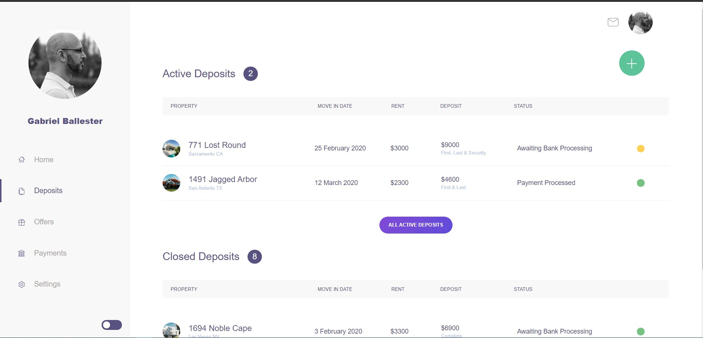
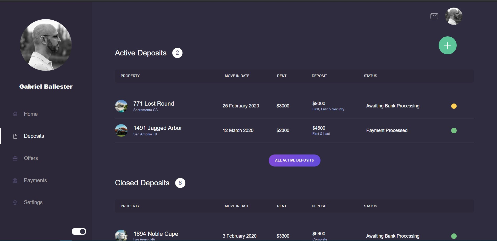

# React admin panel light / dark mode toggle

## Technologies used:

- React
- Styled components
- Context store

## Install dependencies

`yarn install`

## Start development server

`yarn start`

Runs the app in the development mode.
Open [http://localhost:3000](http://localhost:3000) to view it in the browser.

## Light mode

## Dark mode

